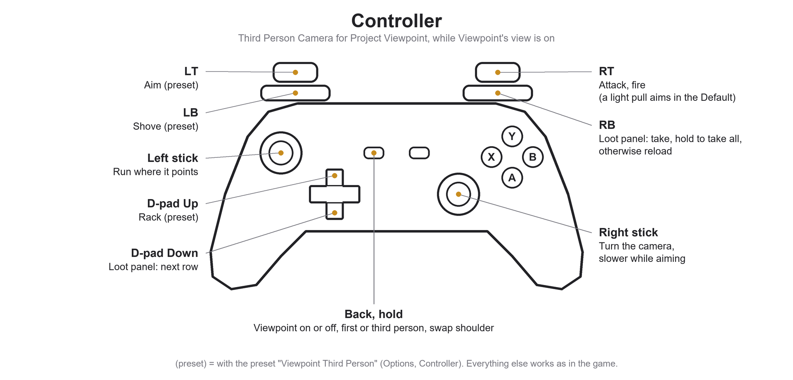
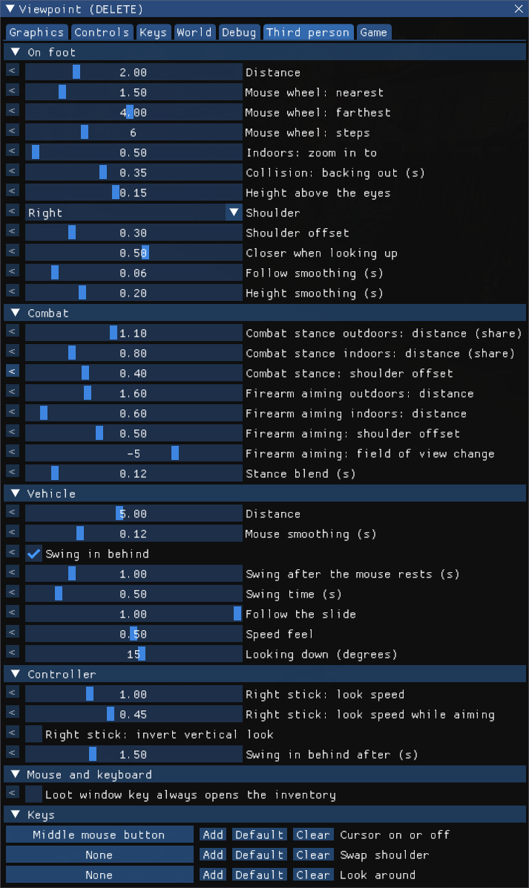
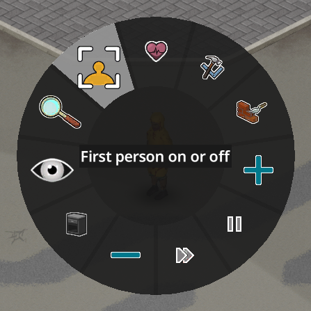

# Third Person Camera for Project Viewpoint

A dynamic third-person camera for [Project Viewpoint](https://steamcommunity.com/sharedfiles/filedetails/?id=3809306528), on foot and in vehicles, for Project Zomboid B42. Made for **mouse and keyboard**, with full **controller** support.

- Zoom with the mouse wheel, on foot and in vehicles.
- Separate camera stances for melee and firearms: wide to watch your flanks, over the shoulder when you aim.
- Accuracy stays as the game sets it, by your Aiming skill. This mod does not change it and never will.
- Moves in when you enter a room and back out when you leave.
- In vehicles it swings in behind you and reacts to how you drive.
- Swap shoulders and look around your character with a key, menus free the cursor on their own.
- Smooth vehicle motion at high frame rates.
- Everything adjustable under **Third person** in Viewpoint's settings, the keys under **Third person, Keys**.

**Controller:** within the game's own layout the right stick turns the camera on foot and in vehicles, and aiming moves to RT, or to LT with the bundled preset. Viewpoint's views switch from the game's Back wheel. The character runs wherever the left stick points, the camera swings in behind once the stick rests, and D-pad Down and RB work Viewpoint's loot panel while it shows. The preset **Viewpoint Third Person** appears in Options, Controller, Preset after a save with the mod has been loaded once.

## Screenshots

## Requirements

- Project Zomboid B42.21
- [ZombieBuddy](https://steamcommunity.com/sharedfiles/filedetails/?id=3619862853)
- Project Viewpoint

## Building

Copy `build.local.example` to `build.local`, set the paths, then run `bash build.sh`. It compiles against Project Zomboid, ZombieBuddy and Viewpoint and installs the mod into `~/Zomboid/mods/ViewpointThirdPerson`.

## License

MIT
